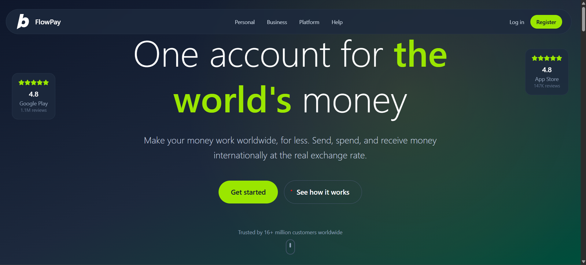

# 💸 FlowPay – Modern Payment App

An end-to-end payment platform web application built using **React**, **TypeScript**, **Tailwind CSS**, and **Vite**. FlowPay enables users to manage money, send and receive international payments, and access multi-currency accounts with a beautiful, responsive UI. Inspired by leading fintech apps, this project demonstrates modern design, smooth navigation, and real-world payment features.

---

<div align="center">
  <br />
  <a href="https://youtu.be/YOUR_VIDEO_ID" target="_blank">
    
  </a>
  <br />
  <div>
    
    
    
    
    
  </div>
  <h3 align="center"> Modern Payment App built with React, TypeScript, Tailwind CSS, and Vite </h3>
  <br />
</div>

---

## 📌 Table of Contents

- [Features](#-features)
- [Screenshots](#-screenshots)
- [Tech Stack](#-tech-stack)
- [Getting Started](#-getting-started)
- [Available Scripts](#-available-scripts)
- [Contributing](#-contributing)
- [License](#-license)
- [Author](#-author)
- [Useful Links](#-useful-links)

---

## 🚀 Features

### For Users:

- 💸 Send and receive money internationally
- 🌍 Multi-currency account and debit card support
- 🔍 Transparent exchange rates, no hidden fees
- 📱 Downloadable app for iOS and Android
- 🛡️ 24/7 customer support
- 📊 Dashboard for currency and transaction management

### General:

- ⚡ Fast, fair, and secure money transfers
- 🧩 Modular, component-based UI
- 📱 Fully responsive design for all devices
- 🌗 Light/Dark mode ready (customizable)
- 🖼️ Animated UI with Framer Motion and Lucide icons

---

## 🖼️ Screenshots

> _ Coming Soon_

---

## 🛠️ Tech Stack

| Tech             | Purpose                         |
| ---------------- | ------------------------------- |
| React            | Front-end framework             |
| TypeScript       | Type safety and maintainability |
| Vite             | Fast bundler and dev server     |
| Tailwind CSS     | Utility-first CSS styling       |
| React Router DOM | Routing and navigation          |
| Lucide-React     | Modern icons                    |
| Framer Motion    | Animations                      |

---

## 🏁 Getting Started

1. **Clone the repository**

   ```bash
   git clone https://github.com/ashishthomas/Payment-flow-app.git
   cd Payment-App

   ```

2. **Install dependencies**

   ```bash
   npm install
   ```

3. **Start the development server**

   ```bash
   npm run dev
   ```

4. **Open in browser**

   Visit http://localhost:5173

---

## 🚀 Available Scripts

```bash
npm run dev – Start development server
npm run build – Build for production
npm run preview – Preview production build
npm run lint – Run ESLint
```

---

## 🤝 Contributing

Contributions, issues, and feature requests are welcome! Feel free to check issues page.

---

## 📝 License

This project is MIT licensed.

Copyright (c) 2025 Ashish Thomas

---

## 🙋‍ Author

- [Ashish Thomas](https://github.com/ashishthomas)

---

## 🔗 Useful Links

- [React Documentation](https://reactjs.org/)
- [Tailwind CSS Docs](https://tailwindcss.com/)
- [Lucide Icons](https://lucide.dev/)
- [Vite](https://vitejs.dev/)
- [Vercel](https://vercel.com/)
